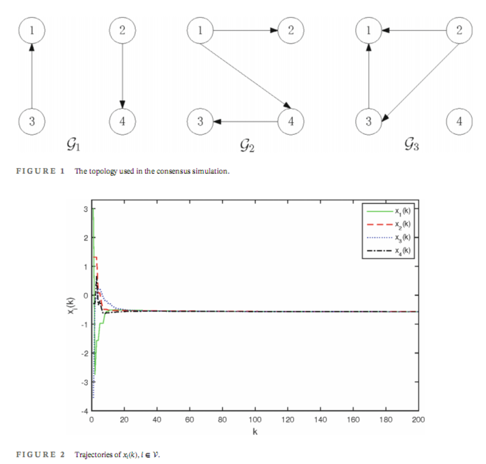

### Consensus results of single or seconde order MASs and applications
The matlab code for some consensus results of MASs and applications.

#### Code 
1. ``consensus convergence to zero`` is the code for the simulation in [Convergence to Zero of Quadratic Lyapunov Functions for Multiagent Systems in Time-Varying Directed Networks](https://ieeexplore.ieee.org/document/10172253/)
2. ``consensus of single order system with rsd noises`` is the code for the simulation in [Consensus in Possibly Unbalanced Switching Networks with Relative-State-Dependent Noises](https://www.tandfonline.com/doi/full/10.1080/00207721.2021.1954718)
3. ``consensus of second order system with rsd noises`` is the code for the simulation in [Consensus of second-order discrete-time multi-agent systems with relative-state-dependent noises](https://onlinelibrary.wiley.com/doi/abs/10.1002/rnc.3816)
4. ``consensus with decay noise and time synchronization`` is the code for the simulation in [Robust consensus of multi-agent systems with multiplicative uncertainties and its application in time synchronization](https://onlinelibrary.wiley.com/doi/abs/10.1002/rnc.6857)

#### Simulation
Part of simulation results are shown below.

